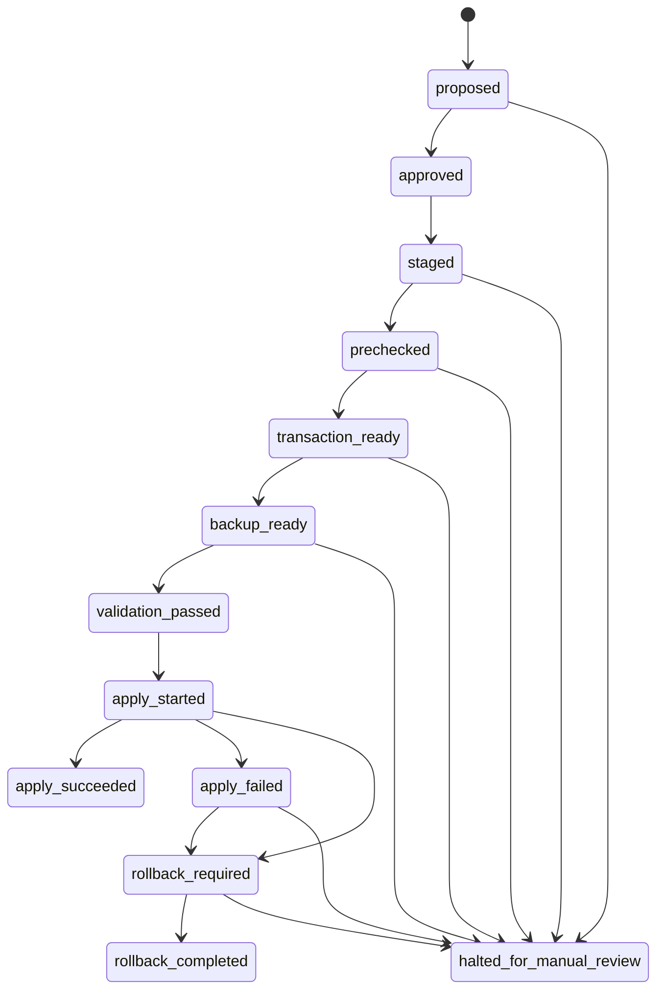

# Apply Executor Contract

이 문서는 `autonomous_agent`의 actual apply 미구현 상태를 전제로, 향후 apply가 붙더라도 느슨하게 시작되지 못하도록 현재 고정된 계약과 경계를 정리한 문서다.

중요:

- 현재 구현은 `proposal -> review -> staging`까지만 수행한다.
- `.precheck.json`, `.apply_plan.json`, `.transaction.json`, `.executor_spec.json`은 모두 metadata-only sidecar다.
- workspace write, patch apply, backup 생성, rollback 실행은 아직 없다.

## 1. Sidecar 구조

런타임 writable 경계는 `runtime-data/`다.

```text
runtime-data/
├── proposals/
│   └── <proposal_id>.json
├── staging/
│   ├── <proposal_id>.json
│   ├── <proposal_id>.precheck.json
│   ├── <proposal_id>.apply_plan.json
│   ├── <proposal_id>.transaction.json
│   └── <proposal_id>.executor_spec.json
└── review_decisions/
    └── <review_id>.json
```

### `proposals/<proposal_id>.json`

검토 전 제안 원본이다.

- `proposal_id`
- `source_review_id`
- `created_at`
- `target_paths`
- `summary`
- `change_type`
- `risk_context`
- `diff_hint`
- `status`

### `staging/<proposal_id>.json`

승인 후 staging에 복사된 proposal 원본이다. 실제 적용용 파일이 아니라, 승인된 제안을 고정해 두는 복사본이다.

### `staging/<proposal_id>.precheck.json`

apply precheck 결과다.

- `apply_possible`
- `apply_mode`
- `apply_blockers`
- `apply_warnings`
- `allowed_target_paths`
- `blocked_target_paths`
- `operator_steps`

이 파일은 apply 가능 여부를 설명하지만, apply를 수행하지는 않는다.

### `staging/<proposal_id>.apply_plan.json`

apply plan preview metadata다.

- `apply_mode`
- `apply_plan`
- `validation_checks`
- `rollback_plan`
- `dry_run`

이 파일은 어떤 변경이 예정될 수 있는지만 설명한다. 실제 write 동작은 없다.

### `staging/<proposal_id>.transaction.json`

atomicity / rollback / validation / failure handling metadata다.

- `atomicity_policy`
- `rollback_triggers`
- `backup_plan`
- `pre_apply_validation`
- `post_apply_validation`
- `failure_handling_policy`

이 파일은 트랜잭션 실행 상태가 아니라, 나중에 actual apply가 따라야 할 안전 경계를 기록한다.

### `staging/<proposal_id>.executor_spec.json`

actual apply executor가 미래에 반드시 따라야 할 실행 계약이다.

- `executor_spec_version`
- `transaction_id_format`
- `state_machine`
- `transaction_state_contract`
- `target_resolution_contract`
- `atomic_write_contract`
- `backup_materialization_contract`
- `rollback_execution_contract`
- `apply_abort_conditions`
- `transaction_markers`
- `transaction_runtime_storage`
- `idempotency_policy`
- `execution_prohibitions`

이 파일도 metadata-only다. 경로를 실제로 resolve하거나 파일시스템 상태를 검사하지 않는다.
또한 future actual apply 제약을 설명하는 계약일 뿐, 실행 권한을 부여하지 않는다.

### future runtime transaction state

실행 시점 runtime state는 staging metadata와 분리돼야 한다. 현재 계약은 아래 경로 규칙을 고정한다.

```text
runtime-data/runtime/<transaction_id>.json
```

목적:

- execution state 추적
- rollback trace 기록
- marker 기록

즉, `staging/*.json`은 정적 계약/승인 산출물이고, `runtime-data/runtime/*.json`은 future execution lifecycle metadata다.

### `review_decisions/<review_id>.json`

운영자 승인/거절 기록이다.

- `review_id`
- `proposal_id`
- `decision`
- `decided_at`
- `reason`
- `operator`

## 2. 상태 전이 계약

actual apply는 아직 구현되어 있지 않지만, 나중에 붙더라도 아래 상태 전이를 벗어나면 안 된다.



핵심 원칙:

- `apply_started` 전에는 모든 backup/validation/transaction metadata가 준비돼 있어야 한다.
- `apply_started` 이후 terminal state는 명확해야 한다.
- partial apply 상태는 허용되지 않는다.
- rollback failure 또는 unknown state는 `halted_for_manual_review`로만 빠질 수 있다.

## 3. Apply 금지 조건

현재 정책은 deny-by-default다. 즉, apply는 기본적으로 금지이며, metadata가 설명하는 것은 “왜 지금 시작하면 안 되는지”다.

| 분류 | 금지/중단 조건 | 의미 |
|------|----------------|------|
| Precheck | `apply_mode == blocked` | 현재 proposal은 시작 단계에서 차단 |
| Target policy | `blocked_target_detected` | allowlist 밖 경로가 target에 포함됨 |
| Target policy | `target_count_mismatch` | 계획된 target 수와 실제 해석 결과가 다르면 중단 |
| Target policy | `unresolvable_target_path` | 문자열 수준에서도 안전한 target 해석 규칙을 만족하지 못함 |
| Path safety | absolute path | 절대 경로 target은 금지 |
| Path safety | parent traversal (`..`) | 상위 디렉터리 이동이 필요한 target은 금지 |
| Validation | `critical_validation_failed` | pre-apply validation 실패 시 시작 금지 |
| Validation | `incomplete_transaction_metadata` | transaction state/marker 계약이 완전하지 않으면 시작 금지 |
| Backup | `backup_not_materialized` | backup materialization contract를 만족하지 못하면 시작 금지 |
| Backup | `backup_target_missing` | backup 대상 정의가 불완전하면 중단 |
| Atomicity | `partial_write_detected` | 일부만 쓰인 상태가 감지되면 즉시 rollback required |
| Atomicity | rename failure | atomic write 마지막 단계 실패 시 rollback required |
| Rollback | backup unavailable | rollback 불가능 상태면 apply 시작 자체가 금지돼야 함 |
| Recovery | unknown state | 상태 불명확 시 자동 진행 금지, manual review 필요 |

## 4. Atomicity / Backup / Rollback 계약

### Atomic write contract

현재 고정된 원칙:

- `atomic_write_mode = temp_then_rename`
- `partial_write_policy = forbidden`
- `all_or_nothing`
- first write 전:
  - 모든 backup 준비 완료
  - 모든 validation 통과
  - transaction state 기록 완료
- rename 실패 시:
  - `rollback_required`

즉, actual apply가 나중에 붙더라도 “한 파일씩 그냥 덮어쓰기” 방식은 계약 위반이다.

### Backup materialization contract

현재 고정된 원칙:

- `backup_strategy = copy_before_apply`
- `backup_scope = all_target_paths`
- backup naming rule 필요
- backup metadata recorded before apply
- backup 미완료 상태에서 first write 시작 금지

즉, backup은 optional이 아니라 apply 시작 전 필수 전제다.

### Rollback execution contract

현재 고정된 원칙:

- `rollback_mode = full_only`
- partial rollback 금지
- rollback trigger:
  - `post_apply_validation_failed`
  - `partial_apply_detected`
  - `unexpected_write_failure`
  - `backup_missing`
- rollback failure 시:
  - `halt_and_require_manual_review`

즉, 일부만 되돌리는 식의 느슨한 복구는 현재 계약상 허용되지 않는다.

## 5. Success / Failure Marker 계약

actual apply가 없더라도, 나중에 붙을 executor는 marker 규칙을 따라야 한다.

기본 marker 집합:

- `apply_started`
- `apply_succeeded`
- `apply_failed`
- `rollback_started`
- `rollback_completed`

기본 규칙:

- `terminal_marker_rule_summary = exactly one terminal marker required`
- `validation_passed` 없이 success marker 기록 금지
- failure/rollback 경로도 transaction state와 함께 기록돼야 함
- 동일 `transaction_id` 재실행 시 duplicate marker 금지
- terminal marker 이후 state mutation 금지

즉, apply가 끝났는데 terminal marker가 없거나 success/failure가 동시에 남는 상태는 계약 위반이다.

## 6. Transaction ID / Idempotency 계약

현재 고정된 규칙:

- `transaction_id_format = uuid_v4`
- `transaction_id_generation_rule = uuid_v4`
- `transaction_id_recording_order = generated_before_transaction_state_recorded`

선택 이유:

- 충돌 가능성이 매우 낮다
- 문자열 기반 식별자로 추적 가능하다
- transaction runtime state와 backup naming rule에 안정적으로 연결할 수 있다

idempotency 정책은 현재 metadata-only로 고정돼 있다.

- `mode = strict`
- `no duplicate writes`
- `no duplicate markers`
- `no state mutation after terminal marker`
- `repeated execution of the same transaction_id must be a no-op once terminal`

이 규칙은 future executor가 따라야 할 계약이며, 지금 단계에서 실제 enforcement는 없다.

## 7. review_pending 에서 보이는 요약

`review_pending.py show <index>`는 현재 아래 순서로 apply 관련 경계를 요약한다.

1. `[Proposal]`
2. `[Apply Precheck]`
3. `[Apply Plan Preview]`
4. `[Apply Safety Boundary]`
5. `[Executor Specification]`

`[Executor Specification]` 블록은 compact summary만 보여준다.

- `atomic_write_mode`
- `rollback_mode`
- `backup_strategy`
- `partial_write_policy`
- `terminal_marker_rule`

이 출력의 목적은 실행이 아니라, “지금 왜 쉽게 apply하면 안 되는지”를 운영자가 바로 확인하게 하는 데 있다.

## 8. 절대 금지 규칙

executor specification은 아래 금지 규칙을 명시적으로 포함한다.

- actual apply implementation is not part of this phase
- no file writes are allowed
- no backup files are created
- no rollback is executed
- no subprocess execution
- no automatic apply trigger

필수 해석 규칙:

> This specification defines constraints for future execution and must not be interpreted as permission to execute apply.

## 9. Actual apply를 아직 안 붙이는 이유

현재 단계에서 actual apply를 붙이지 않는 이유는 기술 부족이 아니라 안전 경계 우선 원칙 때문이다.

### 1. backup materialization이 아직 metadata-only다

지금은 backup strategy와 조건만 정의돼 있다. 실제 backup artifact가 만들어지지 않으므로, write를 시작하면 rollback 가능성이 보장되지 않는다.

### 2. atomic write가 아직 실행 계층으로 강제되지 않는다

`temp_then_rename`, `all_or_nothing`, `partial_write_policy = forbidden`은 정의돼 있지만, 아직 이를 강제하는 executor는 없다.

### 3. rollback이 실제로 materialize되지 않았다

rollback trigger와 rollback mode는 정의돼 있지만, 실제 restore 수행 계층은 없다.

### 4. target resolution이 계약 수준에만 있다

현재 target path contract는 문자열 규칙만 정의한다. 실제 filesystem 충돌, target 존재 여부, rename 가능성은 아직 runtime executor가 검증하지 않는다.

### 5. success / failure visibility가 아직 sidecar 수준이다

지금은 marker 구조와 transaction state 계약만 정의돼 있다. 실제 apply 실행 중간 상태를 durable하게 남기는 runtime protocol은 없다.

### 6. deny-by-default를 유지해야 한다

현재 시스템 목적은 자동 수정이 아니라:

- 판단
- 설명
- 검토
- staging

까지를 안전하게 고정하는 것이다. actual apply는 이 경계를 모두 실행 계층에서 강제할 수 있을 때만 고려 대상이 된다.

## 10. 현재 결론

현재 `autonomous_agent`는 actual apply executor를 구현한 상태가 아니다. 대신 아래를 이미 고정했다.

- proposal/staging/review_decisions handoff
- apply precheck
- dry-run metadata
- apply transaction metadata
- executor specification contract
- rollback / atomicity / failure handling contract

즉, 지금 시스템은 “적용 기능”보다 “적용이 느슨하게 시작되지 못하도록 막는 안전 경계”를 먼저 고정한 상태다.
