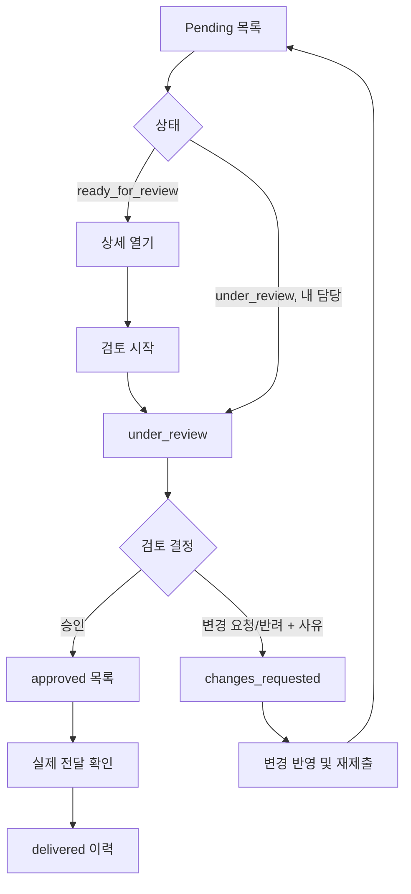

# Approval Queue Design

- 문서 상태: Draft for implementation review
- 대상 사용자: 파일럿 결과를 검토, 승인, 반려, 전달 처리하는 내부 운영자
- 비대상 범위: UI 구현, 알림, 납품 ZIP 조립, 고객 연락 자동화

## 목표

운영자가 긴 편집 없이 대기 작업을 확인하고 검토 시작, 승인, 변경 요청, 전달 완료를 짧고 일관되게 처리할 수 있는 큐 계약을 정의한다.

큐는 Pilot 상태의 조회 화면이지 별도의 진실 원천이 아니다. 목록과 상세 화면은 항상 영속 Pilot 상태와 감사 이력에서 파생한다.

## 권한 경계

구현에서는 역할 이름보다 capability를 기준으로 정책을 정의하는 것을 권장한다.

| capability | 허용 동작 |
| --- | --- |
| `pilot.create` | 접근 가능한 project/run에 Pilot 생성 |
| `pilot.read` | 접근 가능한 Pilot 상세 및 상태 조회 |
| `pilot.submit` | `draft` 또는 `changes_requested`를 검토 큐에 제출 |
| `pilot.review` | 검토 대기/중/변경 요청 큐 조회, 검토 시작, 승인, 변경 요청 |
| `pilot.deliver` | 승인 완료/전달 완료 큐 조회, 실제 전달 완료 기록 |
| `pilot.audit.read` | 감사 이력 조회 |

실제 `UserRole` 매핑은 구현 PR에서 결정한다. 모든 동작은 인증, capability, 프로젝트 접근 범위를 함께 검사해야 한다.

## 기본 목록

운영자 화면은 다음 다섯 목록을 구분한다. 구현 형식은 탭, 필터 또는 섹션 중에서 선택할 수 있지만 상태 분류는 바꾸지 않는다.

| 목록 | 포함 상태 | 주 목적 | 기본 정렬 |
| --- | --- | --- | --- |
| 검토 대기 | `ready_for_review` | 아직 담당자가 시작하지 않은 항목 | `review_requested_at ASC`, 안전한 `pilot_ref ASC` |
| 검토 중 | `under_review` | 담당 운영자가 검토 중인 항목 | `review_started_at ASC`, 안전한 `pilot_ref ASC` |
| 변경 요청 | `changes_requested` | 수정 후 재제출할 항목 | `updated_at DESC`, 안전한 `pilot_ref ASC` |
| 승인 완료 | `approved` | 실제 전달을 기다리는 항목 | `approved_at ASC`, 안전한 `pilot_ref ASC` |
| 전달 완료 | `delivered` | 전달 이력 조회 | `delivered_at DESC`, 안전한 `pilot_ref ASC` |

### 모든 목록의 최소 표시 정보

| 표시 정보 | 계약 |
| --- | --- |
| 프로젝트 식별용 공개 정보 | 안전한 프로젝트 표시명 또는 공개 reference. 내부 DB key와 고객 민감정보를 그대로 표시하지 않음 |
| Run 식별 정보 | 운영자가 구분 가능한 안전한 run reference. 내부 경로, bundle ID, 원본 파일명은 제외 |
| 현재 상태 | canonical PilotStatus 값에 대응하는 사용자용 라벨 |
| 생성 시각 | `created_at` |
| 마지막 변경 시각 | `updated_at` |
| 담당 운영자 | 현재 reviewer의 허용된 표시값. Pilot 레코드에 실명/연락처를 복제하지 않음 |
| version | 상태 변경 요청에 사용할 현재 version |
| 검토용 DOCX 존재 여부 | `docx_available` boolean만 표시. 저장 경로와 원본 파일명은 미노출 |

상태 변경 호출에는 opaque `pilot_id`가 필요할 수 있지만 UI에 민감한 내부 식별자를 그대로 노출하지 않는다. external 고객 응답에는 queue item이나 Pilot 내부 식별자를 포함하지 않는다.

## 큐 화면 구성

### Pending

운영자가 지금 검토해야 할 항목을 보여준다.

- 기본 포함 상태: `ready_for_review`, `under_review`.
- `ready_for_review`: 아직 담당자가 검토를 시작하지 않은 항목.
- `under_review`: 담당자와 검토 시작 시각이 있는 진행 중 항목.
- 기본 정렬: `ready_for_review` 진입 시각 오름차순, 그다음 안전한 `pilot_ref` 오름차순.
- 필터: 상태, reviewer, 프로젝트, 제출 기간.
- 기본 행 정보는 위 최소 표시 정보와 대기 시간을 따른다.

### Changes requested

수정 또는 추가 확인 후 재제출해야 할 항목을 보여준다.

- 상태: `changes_requested`.
- 표시: 최근 변경 사유의 제한된 미리보기, 요청자, 요청 시각.
- 동작: 상세 확인, 변경 반영 후 Resubmit.
- 금지: 큐에서 직접 승인 또는 Delivered 처리.

### Approved / awaiting delivery

검토는 통과했지만 실제 고객 전달이 아직 확인되지 않은 항목을 보여준다.

- 상태: `approved`.
- 표시: 승인자, 승인 시각, 권한이 적용된 미리보기 handle. 내부 경로나 원본 파일명은 표시하지 않는다.
- 동작: 전달 증적을 확인한 뒤 Mark delivered.
- 금지: 파일 생성만으로 자동 Delivered 처리.

### Delivered

전달 완료 이력을 조회한다.

- 상태: `delivered`.
- 기본 정렬: `delivered_at` 내림차순.
- 표시: 전달 처리자, 전달 시각, 제한된 전달 참조값.
- 읽기 전용이며 상태 변경 동작을 제공하지 않는다.

## 운영자 UX 흐름

## 상세 검토 화면 계약

운영자가 결정을 내리는 데 필요한 최소 정보만 보여준다.

- 프로젝트 및 run 식별 정보
- 현재 상태, 상태 진입 시각, 현재 버전
- 1페이지 요약
- 주요 리스크/한계
- external 출력 미리보기 또는 안전한 링크
- internal 검토본 링크(권한이 있는 경우에만)
- 민감 정보 노출 점검 결과
- 감사 이력 요약

원본 파일 전체 내용이나 내부 경로를 queue payload에 복제하지 않는다. 상세 자료는 기존 접근 제어가 적용된 내부 화면으로 연결한다.

## 운영자 행동

| 행동 | 대상 | 계약 |
| --- | --- | --- |
| 미리보기 | 검토 대기/중/변경 요청/승인 완료 | 권한이 적용된 external-safe DOCX 또는 결과 화면을 열며 저장 경로를 응답하지 않음 |
| 검토 시작 | `ready_for_review` | `start_review`를 실행해 `under_review`로 전이 |
| 승인 | `under_review` | `approve`를 실행해 `approved`로 전이 |
| 변경 요청/반려 | `under_review` | 사유와 함께 `request_changes`를 실행해 `changes_requested`로 전이 |
| 감사 이력 확인 | 접근 가능한 모든 상태 | 상태 전이 메타데이터만 조회하며 원문/파일 정보는 제외 |

“반려”는 `request_changes`의 사용자용 표현이며 별도 상태나 별도 전이 규칙을 만들지 않는다.

## 동작 계약

| UI 동작 | 허용 상태 | 결과 상태 | 추가 입력 | 실패 시 동작 |
| --- | --- | --- | --- | --- |
| 검토 제출 (`submit`) | `draft` | `ready_for_review` | 기대 버전, idempotency key | 목록을 갱신하고 오류를 명시 |
| 검토 시작 | `ready_for_review` | `under_review` | 기대 버전, idempotency key | 다른 reviewer가 먼저 시작하면 충돌 표시 |
| 승인 | `under_review` | `approved` | 기대 버전, idempotency key | 중복 클릭은 중복 이벤트를 만들지 않음 |
| 변경 요청/반려 | `under_review` | `changes_requested` | 사유, 기대 버전, idempotency key | 사유 누락은 validation 오류 |
| 재제출 (`resubmit`) | `changes_requested` | `ready_for_review` | 기대 버전, idempotency key | stale 상태면 새 상태를 보여줌 |
| 전달 완료 | `approved` | `delivered` | 기대 버전, 전달 참조값(선택), idempotency key | 승인 전 또는 중복 전달은 충돌 표시 |

승인과 변경 요청 버튼은 `under_review`에서만 활성화한다. 클라이언트 비활성화는 편의 기능일 뿐이며 서버가 같은 규칙을 반드시 다시 검증해야 한다.

## 동시성 및 중복 처리

- 모든 생성/상태 변경 명령은 idempotency key를 보내고, 모든 상태 변경 명령은 화면에 표시된 `version`을 `expected_version`으로 보낸다.
- 먼저 성공한 명령만 상태와 버전을 변경한다.
- 오래된 화면의 명령은 현재 상태와 버전을 포함한 conflict로 응답한다.
- 같은 idempotency key의 네트워크 재시도는 최초 결과를 반환하고 감사 이벤트를 추가하지 않는다.
- 승인된 Pilot을 다른 idempotency key로 다시 승인하면 version 또는 state transition conflict다. 같은 key/payload의 retry만 최초 결과를 재사용한다.
- 이미 `delivered`인 항목의 같은 deliver 요청은 같은 key/payload일 때 최초 결과를 재사용하고, 새 key면 version 또는 state transition conflict다.
- 큐 목록 조회와 상태 변경 사이에 상태가 바뀔 수 있으므로 변경 성공 후 해당 행을 서버 결과로 교체한다.

## 오류 표시 원칙

| 오류 | 운영자 표시 |
| --- | --- |
| 인증 만료 | 재인증 필요 |
| 권한 없음 | 이 작업을 수행할 권한이 없음 |
| Pilot 없음 | 삭제/식별 오류가 아닌지 확인 가능한 Not found |
| 상태 충돌 | 다른 작업자가 먼저 처리했음을 알리고 최신 상태 새로고침 |
| validation 오류 | 잘못된 필드와 수정 방법 표시 |
| 일시적 저장 실패 | 성공으로 보이지 않게 유지하고 안전한 재시도 제공 |

오류가 발생했을 때 클라이언트가 상태를 추측해 변경하거나 성공처럼 표시하지 않는다.

## 개인정보 및 감사 원칙

- 목록에는 판단에 필요한 최소 메타데이터만 포함한다.
- 고객 원문, 원본 파일명, 내부 파일 경로는 목록 응답에서 제외한다.
- 변경 사유 전체를 일반 애플리케이션 로그에 기록하지 않는다.
- 승인/반려/전달 동작은 actor와 시각을 감사 이력에 남긴다.
- Delivered 목록도 운영자 권한과 프로젝트 접근 범위를 적용한다.
- 큐 조회 자체의 감사 필요 여부는 보안 정책과 트래픽 비용을 검토해 구현 PR에서 결정한다.

## 완료 기준

- Pending 목록에서 `ready_for_review`와 `under_review`가 안정적인 순서로 조회된다.
- 승인, 변경 요청, 재제출, 전달 완료가 상태 머신과 동일하게 동작한다.
- 동시 승인과 중복 클릭이 중복 상태 변경 또는 중복 감사 이벤트를 만들지 않는다.
- Delivered 이력이 재시작 이후에도 조회된다.
- 다른 사용자의 프로젝트나 권한 없는 Pilot이 노출되지 않는다.
- 목록 및 감사 응답에 보고서 원문, 원본 파일명, 내부 경로가 포함되지 않는다.

## Implementation PR Decisions

- 실제 인증 역할과 capability 매핑
- queue의 UI 형식과 최종 API URL
- 안전한 project/run/pilot 표시 reference 생성 방식
- queue page size, cursor 형식, SLA와 reviewer 재할당 정책
- idempotency 및 감사 데이터 보존 기간
- 영구 취소와 `delivered` 이후 정정 정책

## 관련 문서

- [Pilot State Machine](pilot-state-machine.md)
- [Pilot State Model](pilot-state-model.md)
- [Pilot API Contract](pilot-api-contract.md)
- [Pilot Test Contract](pilot-test-contract.md)
- [ADR: Persistent Pilot State](ADR-persistent-pilot-state.md)
