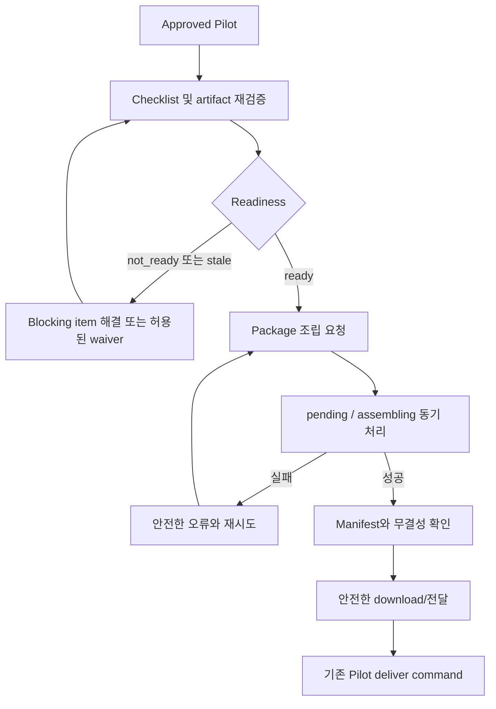

# Delivery Preparedness Operator UX Contract

- 문서 상태: Implementation contract
- 대상 사용자: 납품 준비를 검증하고 package를 조립하는 내부 운영자
- 비대상 범위: HTML/JavaScript 구현, 디자인 시스템 변경

## 핵심 흐름

## 화면 정보

- 안전한 project/run/Pilot reference
- Pilot status/version
- checklist template/instance version
- required와 optional item 그룹
- 각 item의 `pending|present|missing|waived|invalid|stale`
- 검증 시각, 안전한 actor 표시, waiver 여부
- readiness와 blocking/warning code
- assembly status/version와 진행 시각
- assembled package의 manifest, checksum, byte size
- 내부 path가 아닌 안전한 preview/download action

## 운영자 행동

| 행동 | 조건 | 결과 |
| --- | --- | --- |
| 미리보기 | 권한과 safe artifact 존재 | 기존 external-safe DOCX viewer 사용 |
| item 재검증 | mutable 상태, verify 권한 | resolver 결과와 version 갱신 |
| waiver | 허용 item, waiver 권한, reason | audit와 함께 `waived` |
| 조립 요청 | Pilot approved + readiness ready | `pending` assembly |
| 상태 새로고침 | 모든 assembly 상태 | current source version 표시 |
| 재시도 | failed + source current | 새 attempt 또는 pending 전이 |
| manifest 확인 | assembled | safe manifest 표시 |
| download | checksum 통과 + 권한 | opaque download reference 사용 |

중복 클릭은 같은 idempotency key를 재사용하며 버튼 비활성화만을 서버 중복 방지로 신뢰하지 않는다.

## 필수 UX 상태

| UX 상태 | 표시와 복구 행동 |
| --- | --- |
| `loading` | skeleton/progress와 취소 불가 상태를 명확히 표시 |
| `empty` | checklist 또는 package가 없는 이유와 생성/새로고침 행동 |
| `ready` | blocking 0건과 조립 가능 행동 |
| `not_ready` | item별 blocking code와 해결 행동 |
| `assembling` | 진행 중, 중복 요청 차단, 안전한 새로고침 |
| `assembled` | manifest/checksum/download 행동 |
| `failed` | 안전한 오류 code, retry 가능 여부 |
| `stale` | 변경된 source와 재검증 행동 |
| `conflict` | 최신 version을 다시 불러오고 입력을 보존 |
| `unauthorized` | 민감한 대상 존재 여부를 추가 노출하지 않고 권한 안내 |

`pending`은 `assembling` 화면의 대기 단계로 표시할 수 있지만 service 상태값은 구분한다.

## 접근성

- 모든 item/action에 고유한 accessible name을 제공한다.
- 키보드만으로 item 탐색, waiver dialog, assembly, manifest 확인이 가능해야 한다.
- 상태를 색상만으로 표현하지 않고 icon + text + programmatic status를 함께 제공한다.
- mutation 성공 후 관련 heading 또는 status region으로 focus를 이동한다.
- validation/conflict 오류는 해당 field와 연결하고 복구 행동을 제공한다.
- 비동기 진행은 `aria-live`에 과도한 원문을 넣지 않고 단계 변경만 알린다.
- assembly 버튼은 처리 중 중복 클릭을 막되, 서버 idempotency가 최종 보호다.

## 개인정보 및 내부 경계

- 내부 path, 원본 filename, raw content, bundle ID, DB numeric ID를 표시하지 않는다.
- waiver reason은 권한 있는 상세 화면에서만 제한적으로 표시하고 목록/manifest에는 복제하지 않는다.
- 실제 이메일/전화번호를 actor 표시로 사용하지 않는다.
- 오류 dialog에 stack trace나 storage exception을 표시하지 않는다.
- download는 브라우저가 내부 filesystem path를 알지 못하는 opaque reference를 사용한다.

## Priority 2와의 관계

- approval queue에서 `approved` Pilot을 열어 readiness 화면으로 이동한다.
- assembly queue는 approval queue와 별개다.
- assembled가 곧 delivered는 아니다. 실제 전달 후 기존 `deliver` action을 명시적으로 실행한다.
- `delivered` 화면은 package/manifest 조회만 제공하며 mutation을 제공하지 않는다.

## 구현 결정과 비차단 후속 범위

- Phase 3 구현 PR은 service와 API 계약까지만 제공하며 새 HTML 화면은 만들지 않는다. 기존 운영 화면의 후속 UI는 이 상태/행동 계약을 사용한다.
- assembly는 동기 요청이다. 브라우저 연결이 끊기면 `GetPackageAssembly`로 최종 상태를 조회하며 polling transport나 push channel은 추가하지 않는다.
- external-safe preview는 프로젝트 소유자와 `ADMIN`이 읽을 수 있고, verify/waiver/assembly/download는 `ADMIN`만 수행한다.
- delivered 정정 UI는 제공하지 않는다. 새 run/Pilot 생성은 기존 프로젝트 운영 흐름에서 수행하며 별도 정책 PR로 다룬다.

## 관련 문서

- [Checklist Model](delivery-checklist-model.md)
- [Readiness Contract](delivery-readiness-contract.md)
- [API Contract](delivery-package-api-contract.md)
- [Manifest Contract](delivery-package-manifest.md)
