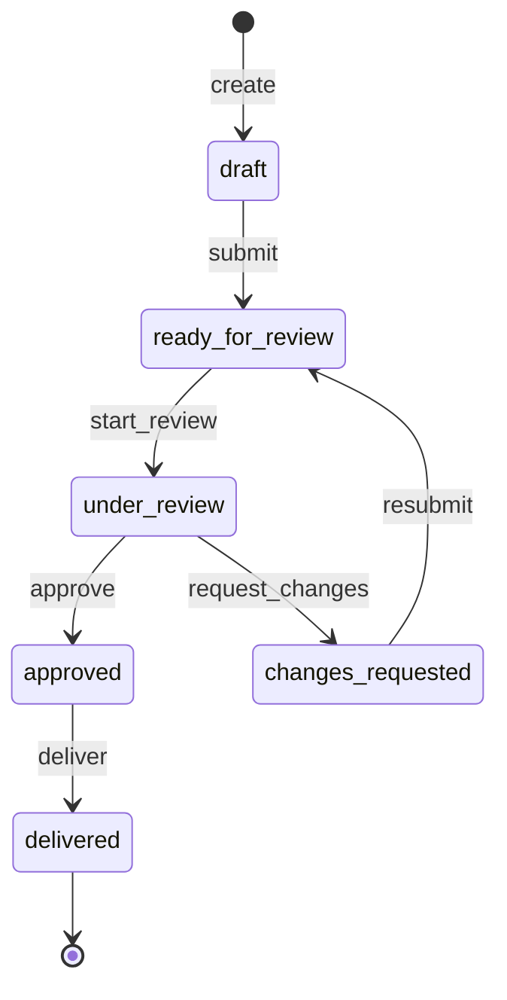

# Pilot State Machine

- 문서 상태: Draft for implementation review
- 대상 범위: 파일럿 결과의 운영자 검토, 승인, 납품 상태
- 비대상 범위: DB/ORM 선택, migration, API 구현, UI 구현, 납품 패키지 조립

## 목적

파일럿 결과가 생성된 뒤 고객에게 전달되기까지의 상태를 하나의 명시적 계약으로 고정한다. 상태 전이는 서비스 계층의 단일 정책을 통해서만 수행하며, 모든 성공한 전이는 감사 이력을 남긴다.

이 상태는 분석 실행 상태(`pending`, `running`, `completed`, `failed`)와 별개다. 분석 실행이 완료됐다는 사실만으로 파일럿 결과가 승인되거나 전달된 것으로 보지 않는다.

## 상태 흐름

## 권위 있는 상태 전이표

이 표는 구현과 테스트의 단일 기준이다. `event`는 service command 이름이고 `audit event`는 성공한 최초 처리에서 append되는 감사 이벤트 이름이다. 모든 상태 변경은 현재 `version`과 정확히 같은 `expected_version` 및 `idempotency_key`를 요구한다.

| 현재 상태 | event | 다음 상태 | 실행 capability | 필수 입력 | idempotency 동작 | audit event | version | 주요 실패 조건 |
| --- | --- | --- | --- | --- | --- | --- | --- | --- |
| 없음 | `create` | `draft` | `pilot.create` + 프로젝트 접근 | `project_id`, `run_id`, `idempotency_key` | 같은 key/payload 재요청은 동일 생성 결과 반환 | `pilot_created` | `0`으로 생성 | 입력 오류, 권한 없음, project/run 불일치, 논리 중복, key payload 충돌 |
| `draft` | `submit` | `ready_for_review` | `pilot.submit` + 프로젝트 접근 | `expected_version`, `idempotency_key` | 같은 key/payload 재요청은 최초 결과 반환 | `pilot_submitted` | 정확히 `+1` | 결과 미준비, 권한 없음, version 불일치, 현재 상태 불일치, key payload 충돌 |
| `ready_for_review` | `start_review` | `under_review` | `pilot.review` | `expected_version`, `idempotency_key` | 같은 key/payload 재요청은 최초 결과 반환 | `pilot_review_started` | 정확히 `+1` | 권한 없음, 다른 운영자 선점, version 불일치, 현재 상태 불일치, key payload 충돌 |
| `under_review` | `approve` | `approved` | `pilot.review` | `expected_version`, `idempotency_key` | 같은 key/payload 재요청은 최초 승인 결과 반환 | `pilot_approved` | 정확히 `+1` | 권한 없음, 필수 검토 미완료, version 불일치, 현재 상태 불일치, key payload 충돌 |
| `under_review` | `request_changes` | `changes_requested` | `pilot.review` | `reason`, `expected_version`, `idempotency_key` | 같은 key/payload 재요청은 최초 변경 요청 결과 반환 | `pilot_changes_requested` | 정확히 `+1` | 사유 누락/길이 오류, 권한 없음, version 불일치, 현재 상태 불일치, key payload 충돌 |
| `changes_requested` | `resubmit` | `ready_for_review` | `pilot.submit` + 프로젝트 접근 | `expected_version`, `idempotency_key` | 같은 key/payload 재요청은 최초 재제출 결과 반환 | `pilot_resubmitted` | 정확히 `+1` | 변경 미반영, 권한 없음, version 불일치, 현재 상태 불일치, key payload 충돌 |
| `approved` | `deliver` | `delivered` | `pilot.deliver` | `expected_version`, `idempotency_key`; `delivery_reference`는 선택 | 같은 key/payload 재요청은 최초 전달 결과 반환 | `pilot_delivered` | 정확히 `+1` | 실제 전달 미확인, 권한 없음, version 불일치, 현재 상태 불일치, key payload 충돌 |

운영 문구의 “반려”와 “변경 요청”은 모두 `request_changes`를 뜻하며 결과 상태는 `changes_requested` 하나다. 영구 취소 또는 폐기 상태는 이번 범위에 포함하지 않는다.

## 금지 전이표

| 현재 상태 | 금지 event 또는 목표 | 실패 분류 | 보장 사항 |
| --- | --- | --- | --- |
| `draft` | `deliver` / `delivered` | state transition conflict | 상태, version, 감사 이력 불변 |
| `draft` | `approve` / `approved` | state transition conflict | 검토 단계를 건너뛰지 않음 |
| `ready_for_review` | `approve` | state transition conflict | `start_review` 없이 승인 불가 |
| `changes_requested` | `approve` / `approved` | state transition conflict | 반드시 `resubmit` 후 재검토 |
| `approved` | `start_review` / `under_review` | state transition conflict | 승인 취소 정책을 암묵적으로 만들지 않음 |
| `delivered` | `submit`, `start_review`, `approve`, `request_changes`, `resubmit`, `deliver` | state transition conflict | 종결 상태와 감사 이력 불변 |
| 모든 상태 | 현재 상태와 같은 상태를 새 전이로 기록 | state transition conflict | no-op 감사 이벤트를 만들지 않음 |
| 모든 상태 | 권위 있는 전이표의 선행 상태가 아닌 곳에서 실행한 command | state transition conflict | 명시된 정상 전이 외의 암묵적 경로를 만들지 않음 |

동일 idempotency key와 동일 payload의 재요청은 금지 전이가 아니라 최초 성공의 replay다. 새 상태 변경이나 새 감사 이벤트를 만들지 않는다.

## 상태별 계약

### `draft`

- 의미: 파일럿 상태 레코드는 생성됐지만 운영자 검토를 요청하지 않은 편집 가능 단계다.
- 진입 조건: Create Pilot이 성공하고 동일한 `(project_id, run_id)` Pilot이 없어야 한다.
- 종료 조건: 검토 가능한 결과가 준비되고 소유권 또는 제출 권한을 가진 사용자가 `submit`을 실행한다.
- 허용되는 다음 상태: `ready_for_review`.
- 금지되는 전이: `under_review`, `approved`, `changes_requested`, `delivered`로의 직접 전이. 자기 자신으로의 상태 전이도 만들지 않는다.

### `ready_for_review`

- 의미: 운영자 큐에서 검토 시작을 기다리는 상태다.
- 진입 조건: `draft` 또는 `changes_requested`에서 제출 요건을 충족해 `submit`/`resubmit`이 성공한다.
- 종료 조건: 검토 권한을 가진 운영자가 검토를 시작하고 reviewer를 확정한다.
- 허용되는 다음 상태: `under_review`.
- 금지되는 전이: `draft`, `approved`, `changes_requested`, `delivered`로의 직접 전이. 검토 시작 없이 승인하거나 반려할 수 없다.

### `under_review`

- 의미: 특정 운영자가 결과와 external 노출 경계를 검토 중인 상태다.
- 진입 조건: `ready_for_review`에서 `start_review`의 권한과 동시성 검사가 통과하고 reviewer 및 검토 시작 시각이 기록된다.
- 종료 조건: 운영자가 승인하거나 변경 사유를 포함해 반려한다.
- 허용되는 다음 상태: `approved`, `changes_requested`.
- 금지되는 전이: `draft`, `ready_for_review`, `delivered`로의 직접 전이. 승인과 변경 요청을 한 명령에서 동시에 기록할 수 없다.

### `changes_requested`

- 의미: 검토 결과 수정 또는 추가 확인이 필요하며 재제출을 기다리는 상태다.
- 진입 조건: `under_review`에서 비어 있지 않은 변경 사유와 행위자가 기록된다.
- 종료 조건: 변경이 반영되고 제출 권한자가 재검토를 요청한다.
- 허용되는 다음 상태: `ready_for_review`.
- 금지되는 전이: `draft`, `under_review`, `approved`, `delivered`로의 직접 전이. 사유 없는 반려는 허용하지 않는다.

### `approved`

- 의미: 운영자 검토를 통과했지만 실제 고객 전달은 아직 확인되지 않은 상태다.
- 진입 조건: `under_review`에서 승인 권한, 동시성, 필수 검토 조건이 통과하고 승인자와 승인 시각이 기록된다.
- 종료 조건: 실제 전달이 완료되고 납품 권한자가 전달 사실을 기록한다.
- 허용되는 다음 상태: `delivered`.
- 금지되는 전이: `draft`, `ready_for_review`, `under_review`, `changes_requested`로의 전이. 승인 취소 정책은 이번 범위에서 정의하지 않는다.

### `delivered`

- 의미: 승인된 결과가 실제 고객 전달 절차를 완료한 종결 상태다. DOCX 생성만으로 이 상태가 되지 않는다.
- 진입 조건: `approved` 상태에서 실제 전달 사실과 처리자, 전달 시각이 기록된다.
- 종료 조건: 없음.
- 허용되는 다음 상태: 없음.
- 금지되는 전이: 모든 상태 전이. 전달 후 정정은 기존 상태를 되돌리지 않고 별도 후속 정책 또는 새 run으로 처리한다.

## 전역 불변 조건

1. Pilot은 한 시점에 정확히 하나의 상태만 가진다.
2. 허용되지 않은 값이나 전이를 조용히 보정하지 않고 명시적인 validation 또는 conflict 오류로 반환한다.
3. 상태 변경과 감사 이벤트 기록은 하나의 원자적 작업이어야 한다.
4. 모든 변경 명령은 인증된 행위자, 권한, 대상 프로젝트 접근 범위를 검사한다.
5. 모든 생성/상태 변경 명령은 `idempotency_key`를 요구하고, 모든 상태 변경 명령은 `expected_version`도 요구한다.
6. 동일 idempotency key와 동일 payload의 재시도는 최초 결과를 반환하고 새 전이나 새 감사 이벤트를 만들지 않는다.
7. 상태 시각은 timezone-aware UTC instant로 기록하고 API에서도 오프셋을 포함한다.
8. 상태 전이 이벤트에는 보고서 원문, 원본 파일명, 내부 파일 경로를 복제하지 않는다.

## 오류 분류

| 상황 | 계약상 결과 |
| --- | --- |
| 알 수 없는 상태 값 | Validation error |
| 존재하지 않는 Pilot | Not found |
| 허용되지 않은 상태 전이 | State transition conflict |
| 오래된 버전으로 갱신 | Concurrency conflict |
| 같은 승인 명령의 동일 키 재시도 | 기존 성공 결과 재사용 |
| 승인 완료 후 다른 키로 재승인 | State transition conflict |
| 권한 또는 소유권 부족 | Forbidden |

## 동시성 및 idempotency 시나리오

검증 순서는 입력 형식, 인증/대상 접근, 기존 idempotency 결과, 기대 버전, 상태 전이 조건 순으로 해석한다.

| 상황 | 기대 동작 |
| --- | --- |
| 동일 승인 요청이 같은 key로 두 번 전송됨 | 두 번째 요청은 최초 `approved` 결과와 result version을 반환한다. `pilot_approved`는 1개만 존재한다. |
| 두 운영자가 같은 version으로 동시에 승인 | 한 요청만 성공한다. 다른 요청은 version conflict이며 상태와 감사 이력을 변경하지 않는다. |
| 오래된 version으로 상태 변경 | version conflict를 반환한다. 현재 status/version을 안전하게 제공할 수 있으나 내부 payload는 노출하지 않는다. |
| 이미 `delivered`인 Pilot에 같은 deliver 요청 재시도 | 같은 key/payload면 최초 전달 결과를 반환한다. 새 key면 현재 version이 오래된 경우 version conflict, 최신 version이면 state transition conflict다. |
| 네트워크 재시도로 동일 요청 반복 | 같은 key/payload면 HTTP 연결 상태와 무관하게 최초 결과를 재사용하고 감사 이벤트를 늘리지 않는다. |
| 같은 key를 다른 payload나 command에 사용 | idempotency conflict를 반환하고 상태, version, 감사 이력을 변경하지 않는다. |

최초 성공의 상태 변경과 감사 이벤트 기록은 하나의 원자적 작업이다. 둘 중 하나라도 저장되지 않으면 전체 명령이 실패하며 idempotency 성공 결과도 남기지 않는다.

## Implementation PR Decisions

- DB, ORM, 물리 테이블 구조와 migration 도구
- 실제 인증 역할과 capability 매핑
- ID 및 idempotency key 생성/보존 방식
- 영구 취소 정책과 승인 취소 정책
- `delivered` 이후 정정 또는 재납품 정책
- 감사 및 상태 데이터 보존 기간

## 관련 문서

- [Pilot State Model](pilot-state-model.md)
- [Approval Queue Design](approval-queue-design.md)
- [Pilot API Contract](pilot-api-contract.md)
- [Pilot Test Contract](pilot-test-contract.md)
- [ADR: Persistent Pilot State](ADR-persistent-pilot-state.md)
